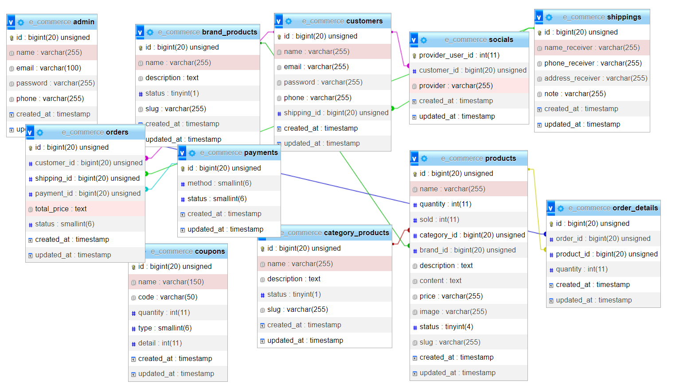

# **Project Overview**  
The online snack shopping website aims to provide a convenient, fast, and secure shopping experience for customers. The system focuses on:  

- **Diverse Product Selection**: Offers a wide range of snacks, candies, beverages, and fast food.  
- **User-Friendly Interface**: Optimized design for easy navigation and fast loading speed.  
- **Flexible Payment Options**: Supports multiple secure payment methods.  
- **Customer Support**: Live chat, product reviews, and shopping assistance.  
- **Order & Customer Management**: Tracks purchase history, promotions, and personalized offers.  
- **Analytics & Optimization**: Provides reports and insights to improve business strategies.  

# **Purpose and Objectives**  

## **Purpose**  
To build a reliable online shopping platform that meets customer needs and optimizes business operations.  

## **Objectives**  
- **Increase sales** through marketing, promotions, and excellent customer service.  
- **Enhance user experience** with a seamless interface, fast performance, and a simplified ordering process.  
- **Compete effectively in the market** by offering high-quality products at competitive prices.  
- **Boost customer loyalty** with personalized discounts and dedicated support.  
- **Optimize business management** through data analytics and reporting tools.  


# Tech Stack:

- Frontend: Blade - A templating engine for PHP that allows developers to create dynamic web pages using a simple and elegant syntax.
- Backend: NestJS - A progressive Node.js framework for building efficient, reliable, and scalable server-side applications
- Database: MySQL - A popular open-source relational database management system

# Key Features

## Customer

-   View products: Customers can browse through products that are available for purchase on the website.
-   Search for products by name: Customers can use the search function to find specific products they are interested in purchasing.
-   Add products to cart: Customers can add products to their cart to keep track of items they want to purchase.
-   Review products: Customers can leave feedback and reviews on products they have purchased to help other users make informed decisions.
-   Login to make purchases: Customers can create an account and log in to complete purchases through the website.
-   Online payment with **VNPAY**: Customers can securely and conveniently complete transactions using VNPAY, an online payment platform.

## Admin

-   Login to system: Administrators can securely log in to the system to access their dashboard and perform administrative tasks.
-   Product management: Administrators can add, modify, and delete products from the website, and manage product categories and inventory levels.
-   Staff account management: Administrators can create, modify, and delete staff accounts, and control staff access rights to the system.
-   Sales performance tracking: Administrators can view sales performance data in the form of **charts and graphs** for easier analysis and decision-making.
-   **Order management**: Administrators can receive and process customer orders, update order status, and track order fulfillment.

# UC diagram


| No. | Actor | Description |
|----|--------------------------------------|-------------------------------------------------------------------------|
| 1 | Customer |  Searches for and views product details, laces orders for products, Completes payments securely, Rates and reviews purchased products|
| 2 | Admin | Manages categories, products, articles, coupons, staff accounts, orders, and reports  |

# Database Schema


# Photo/Video Demo:

### customer screens

-   Some of screens customer

[See more](document/screenshots/customer.md)

<div align='center'>


</div>

---

### admin screens

-   Some of screens admin

[See more](document/screenshots/admin.md)

<div align='center'>


</div>

## Project Setup

### Prerequisites
-   **PHP**: 7.4 or higher
-   **Composer**: A dependency manager for PHP
-   **Laravel**: 8.x
-   **MySQL**: A relational database management system

```
# Clone the repository
git clone 

# Navigate to the project directory
cd snackie

# Install dependencies
composer install

# Copy the .env.example file to .env
cp .env.example .env

# Generate the application key
php artisan key:generate

# Run the migrations
php artisan migrate:fresh --seed

# Start the development server
php artisan serve
```


