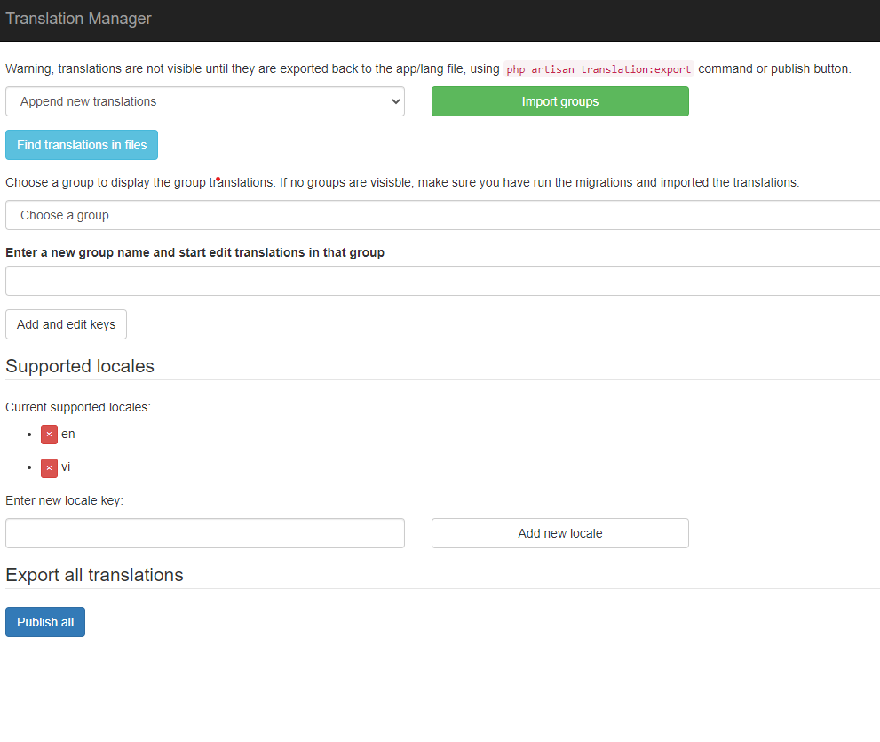

## add language

-   [localization](https://laravel.com/docs/8.x/localization#main-content)

-   In `resources/lang/en` folder, create a file `frontpage.php` and add the following code:

```php
return [
    'home' => 'home',
];
```

-   Cách dùng: `__('frontpage.home')`
-   In `config/app.php` replace `locale` with

```php
 'locales' => ['en', 'vi'],
```

-   Nếu muốn để mặc định là tiếng việt khi mới vào trang web

```php
'fallback_locale' => 'vi',
```

-   Thêm route language vào `web.php`

```php
Route::get('/lang/{locale}', function ($locale) {
    $available_locales = config('app.locales', []);

    if (!in_array($locale, $available_locales)) {
        $locale = config('app.fallback_locale');
    }
    session()->put('locale', $locale);

     return redirect()->back();
})->name('lang');
```

---

## laravel translation manager

-   Cài **laravel translation manager** để lưu ngôn ngữ vào session
-   [laravel translation manager](https://github.com/barryvdh/laravel-translation-manager)

```bash
composer require barryvdh/laravel-translation-manager
```

-   Then run

```bash
php artisan vendor:publish --provider="Barryvdh\TranslationManager\ManagerServiceProvider" --tag=migrations

php artisan migrate

php artisan vendor:publish --provider="Barryvdh\TranslationManager\ManagerServiceProvider" --tag=config
```

-   Mặc định nó sẽ tạo ra 1 cái route là `http://127.0.0.1:8000/translations` để config quản lý ngôn ngữ, có thể mở 1 tab để xem
    
-   Cho phép chúng ta có thể thêm ngôn ngữ, thêm config các từ
-   mặc định là nó yêu cầu auth, nếu muốn không cần auth thì vào file `config/translation-manager.php` và comment `middleware`
-   Bấm nút `Import groups` để import các file `resources/lang
-   Sau khi thêm xong thì nhớ bấm `Publish translation` để lưu lại vô trong file `resources/lang`

---

## localization

-   [localization](https://lokalise.com/blog/laravel-localization-step-by-step/)
-   Tạo 1 cái middleware localization để lưu ngôn ngữ vào session
    để luôn set lại language khi bấm thay đổi

```bash
php artisan make:middleware Localization
```

-   Then in Localization.php file, add the following code:

```php
public function handle(Request $request, Closure $next)
    {
        if (session()->has('locale')) {
            app()->setLocale(session()->get('locale'));
        }

        return $next($request);
    }
```

-   Phải khai bão trong kernel.php thì khi chạy qua web nó luôn chạy qua middleware này

```php
protected $middlewareGroups = [
        'web' => [
            // thêm cái này
            \App\Http\Middleware\Localization::class,
        ],
]
```
